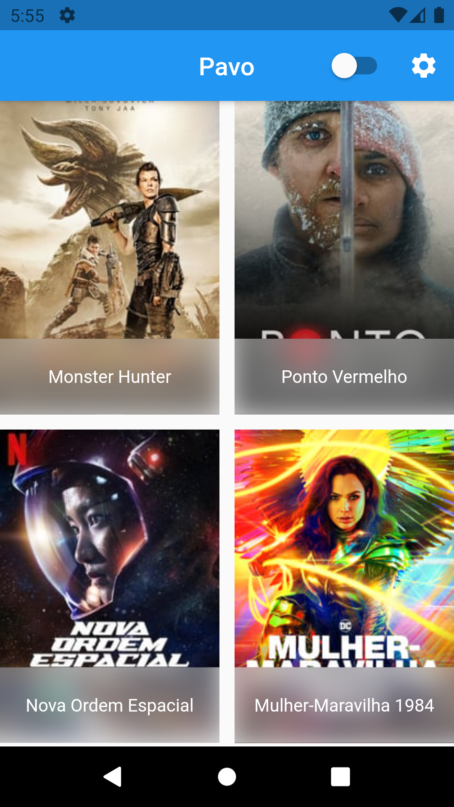

# Pavo

Esse é um projeto pessoal, onde o meu objetivo é praticar e estudar Flutter, sempre visando boas práticas em todos os sentidos.

Tive interesse em criar essa aplicação após me deparar com um respositório do <a href="https://github.com/RobertBrunhage/movie_app">Robert Brunhage</a>. Tentei chegar ao mesmo lugar tentando ir por outro caminho, usando de outros artifícios.

Agora vamos ao que foi usado:

- Estou usando para gerência do estado da aplicação o <a href="https://mobx.netlify.app/">MobX</a> ;

- Para consumir a API estou usando o <a href="https://pub.dev/packages/dio">DIO</a>;

- <a href="https://www.themoviedb.org/documentation/api">API</a> que estou consumindo é da plataforma <a href="https://www.themoviedb.org/">TMDB</a>.

## Telas

### Home

Onde é listado os filmes em alta, segundo a API da plataforma. 

Nessa tela foi criado uma tela de que carrega até o final dos dados que podem ser fornecidos sem recriar novamente a tela, basicamente uma paginação automatica, também conhecida como "Infinite Scrolling", que é recarregado todo momento que o usuário chegar no final da lista. 

Além também de ter a possibilidade de trocar o tema padrão de visualização, entre dark e ligth.

Caso aconteça algum erro do lado do servidor todos os dados serão tratados do nosso lado, e será apresentado uma mensagem de erro amigável. 

## Referências
- [Documentação da API](https://www.themoviedb.org/documentation/api);
- [Comunidade Flutterando](https://flutterando.com.br);
- [Documentação Flutter Online](https://flutter.dev/docs);
- [Documentação MobX Online](https://mobx.netlify.app/).

## Créditos
- Ícone do pavão foi feito por <a href="https://www.flaticon.com/br/autores/freepik" title="Freepik">Freepik</a> from <a href="https://www.flaticon.com/br/" title="Flaticon"> www.flaticon.com</a>